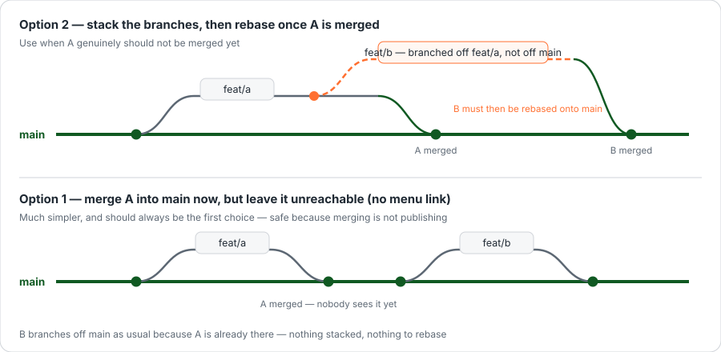

# When your work depends on other work

The most common question after a first pull request: *my change needs another change that is still being reviewed — do I have to wait?*

**No.** There are two ways round it, and the first one is much simpler than people expect.



Throughout this page, **A** is the change that has to happen first, and **B** is yours, which needs it.

## Option 1 — merge A now, but leave it unreachable

**Try this first.**

Merge A into `main` straight away, but make sure nothing leads to it: no link in the menu, or hidden behind a permission nobody has been given yet. B then branches off `main` like any other change, because what it needs is already there.

Nothing is stacked. Nothing has to be rewritten later. B is an ordinary pull request.

::: tip Why this is safe, and not a shortcut
**Merging into `main` does not publish anything.** Work sitting in `main` reaches nobody until a maintainer connects to the VPN and deploys — see [Your first change](/start/first-change), step 8.

So "merged but unreachable" is genuinely two locks: it is not deployed, and even once it is, nothing on the page leads to it. This is how the ฝ่าย pages and several other features landed — merged in pieces over days, switched on at the end.
:::

## Option 2 — stack B on A

Use this only when A genuinely **should not be merged yet**: it is unfinished, or it has not been reviewed and you do not want it in `main` on your say-so.

Branch off A instead of off `main`:

```bash
git checkout feat/a          # stand on the branch that is waiting
git checkout -b feat/b       # branch off A, not off main
```

When you open B's pull request, **change its base branch to `feat/a`.** There is an *Edit* button beside the pull request title on GitHub; the base is the dropdown that appears.

::: warning Do not skip changing the base
If B's base stays `main`, the pull request shows A's changes and B's mixed together, and a reviewer cannot tell which is which — so neither gets reviewed. With the base set to `feat/a`, B's pull request shows only what B added.
:::

Once A is merged into `main`, move B across:

```bash
git checkout main && git pull origin main
git checkout feat/b
git rebase --onto main feat/a feat/b
git push --force-with-lease
```

That last block reads as: *take the commits that are on `feat/b` but not on `feat/a`, and replay them on top of the current `main`.* B's commits get new identities, which is why the push has to be forced.

::: danger `--force-with-lease`, never plain `--force`
`--force-with-lease` refuses if somebody else pushed to the branch while you were working — it checks before it overwrites. Plain `--force` overwrites regardless and can destroy a colleague's commits.

**Only ever force-push a branch that is yours. Never `main`.**
:::

Then set B's base back to `main`. GitHub usually does this for you the moment A is merged.

## What not to do

**Do not keep piling commits into one branch while you wait for A.** It feels productive and it is the slowest option available. The longer a branch lives, the more it collides with everything merged in the meantime, and a pull request too large to read does not get reviewed — it gets postponed.

If your work is genuinely two things, it is two pull requests. Split it and use option 1.

Next — [Troubleshooting](/start/troubleshooting)
