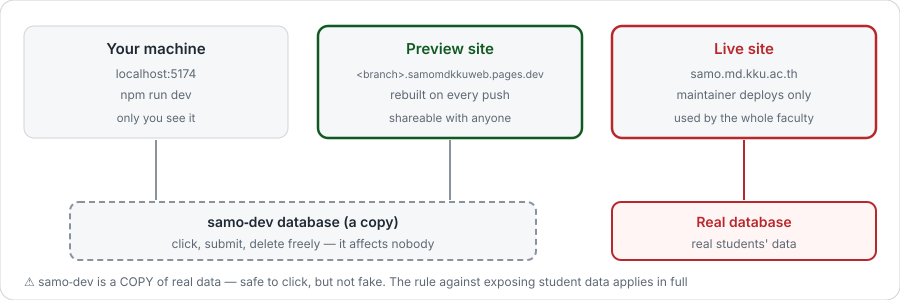

# ส่งการแก้ครั้งแรก

จากแก้ไฟล์บนเครื่อง จนการแก้ของคุณถูกรวมเข้าโปรเจกต์


## 1. ดึงของล่าสุดก่อน

```bash
git checkout main
git pull origin main
```

ใช้เวลา 3 วินาที และกันไม่ให้งานคุณไปชนกับงานคนอื่นตอนส่ง

## 2. สร้าง branch

```bash
git checkout -b ui/news-card-spacing
```

::: warning ต้องสร้าง branch เสมอ
`main` ถูกล็อกไว้ — push ตรงเข้าไปไม่ได้ ระบบจะปฏิเสธ ไม่ใช่แค่ไม่แนะนำ
:::


ตั้งชื่อเป็น `<ประเภท>/<เรื่องสั้น ๆ>` ภาษาอังกฤษ ตัวเล็ก ขีดกลางคั่น

| ขึ้นต้นด้วย | ใช้เมื่อ | ตัวอย่าง |
|---|---|---|
| `feat/` | เพิ่มของใหม่ | `feat/golden-period-page` |
| `fix/` | แก้บั๊ก | `fix/vs-form-double-submit` |
| `ui/` | หน้าตา สี ระยะห่าง | `ui/news-card-spacing` |
| `docs/` | เอกสารอย่างเดียว | `docs/install-guide` |

**ชื่อ branch กลายเป็นที่อยู่เว็บทดลองของคุณ** — `ui/news-card-spacing` จะได้ `https://ui-news-card-spacing.samomdkkuweb.pages.dev` ตั้งชื่อสั้นแล้วอ่านง่ายไปด้วยกัน

**หนึ่ง branch ทำเรื่องเดียว** อยากแก้สองเรื่องที่ไม่เกี่ยวกัน ให้แยกสอง branch — รีวิวเร็วกว่า และเรื่องหนึ่งติดปัญหา อีกเรื่องไม่ต้องรอ

## 3. แก้ แล้วดูผล

เปิด Terminal อีกหน้าต่างทิ้งไว้

```bash
npm run dev
```

แก้ไฟล์ หน้าเว็บรีเฟรชเอง ก่อนไปขั้นต่อไป ให้สองคำสั่งนี้เขียวก่อน

```bash
npm test
npm run build
```

## 4. บันทึกงาน

```bash
git status                       # ดูก่อนว่ามีอะไรเปลี่ยนบ้าง
git add src/css/news.css         # เลือกเฉพาะไฟล์ที่ตั้งใจ
git commit -m "ui(news): ลดระยะห่างการ์ดข่าวบนมือถือ"
git push -u origin ui/news-card-spacing
```

`-u origin <branch>` ใส่แค่ครั้งแรกของ branch นั้น หลังจากนั้น `git push` เปล่า ๆ พอ

::: danger ทำไมต้อง git status ก่อน git add .
`git add .` แปลว่า "ทุกอย่างที่เปลี่ยน" — รวมภาพหน้าจอที่เผลอเซฟไว้ในโฟลเดอร์ และไฟล์ทดลองที่ลืมลบ

โปรเจกต์นี้เปิดสาธารณะ และ**ประวัติ git ลบไม่ได้จริง** ลบไฟล์พรุ่งนี้ ก็ยังย้อนดู commit วันนี้ได้ ชื่อ รหัสนักศึกษา อีเมล รูปถ่ายที่หลุดเข้าไปครั้งเดียว อยู่ตลอดไป
:::

## 5. เปิด Pull Request

```bash
gh pr create --fill --web
```

หรือเปิด GitHub ในเว็บ จะมีแถบ *Compare & pull request* ขึ้นให้กด

เขียนสามอย่าง ไม่ต้องยาว

1. **แก้อะไร** — หนึ่งประโยค
2. **ทำไม** — เดิมเป็นยังไง
3. **ทดสอบยังไง** — จอกว้างเท่าไรบ้าง ปกติเช็ก 390 / 820 / 1280 px

::: tip ยังไม่เสร็จก็เปิดได้
กด *Create draft pull request* — คนอื่นเห็นว่าคุณทำเรื่องนี้อยู่ จะได้ไม่ทำซ้ำ และคุณได้เว็บทดลองมาใช้ตั้งแต่ยังไม่เสร็จ ติดตรงไหนใส่ `[help]` ไว้ในหัวข้อ
:::

## 6. เปิดเว็บทดลองดูของจริง

ทุก branch ได้เว็บของตัวเองอัตโนมัติ ลิงก์โผล่ในหน้า pull request ภายในไม่กี่นาที หรือถามจาก Terminal

```bash
npm run preview:url
```



**เว็บทดลองต่อกับฐานข้อมูลสำเนา ไม่ใช่ของจริง** กดปุ่ม ส่งฟอร์ม สร้างของทิ้งได้เต็มที่ นี่คือที่ที่ควรทดสอบจริง ๆ ไม่ใช่แค่ดูบนเครื่องตัวเอง

ที่อยู่นี้คงที่ตลอดอายุ branch — bookmark ไว้ครั้งเดียว push ทีไรมันอัปเดตเอง ส่งให้เพื่อนในฝ่ายช่วยดูได้ เขาไม่ต้องลงอะไรเลย

## 7. รอ CI กับคนรีวิว

| ตรวจอะไร | ใช้เวลา | ถ้าแดง |
|---|---|---|
| **build** — `npm test` + `npm run build` | ~2 นาที | กด *Details* อ่านบรรทัดแรกที่แดง |
| **Cloudflare Pages** — สร้างเว็บทดลอง | ~2 นาที | มักแปลว่า build พังเหมือนกัน |
| **smoke** — เปิดเว็บทดลองด้วย browser จริง | ~1 นาที | หน้าโหลดขึ้นแต่ปุ่มไม่ทำงาน |

แก้แล้ว **ไม่ต้องเปิด pull request ใหม่** — commit เพิ่มแล้ว `git push` ทับ ทุกอย่างรันใหม่ให้เอง

ใครอนุมัติ ขึ้นกับว่าคุณแตะไฟล์ไหน — ดู [แก้อะไรได้บ้าง](/contributing)

## 8. ถูกรวมแล้ว แต่ยังไม่ขึ้นเว็บจริง

การรวมเข้า `main` ไม่ได้ทำให้ขึ้นเว็บจริง ผู้ดูแลต้องต่อ VPN ของ มข. แล้วสั่ง deploy อีกครั้ง ปกติรวบหลาย pull request แล้ว deploy ทีเดียว

ตั้งใจให้เป็นแบบนี้ — **การกดรับ pull request จึงเป็นเรื่องถูกและถอยกลับได้** จุดตรวจที่จริงจังอยู่ที่ deploy จุดเดียว ไม่ใช่กระจายไปขวางทุกคนตอนรีวิว

## ทุกคำสั่งในที่เดียว

```bash
# เริ่มงานใหม่
git checkout main && git pull origin main
git checkout -b ui/my-topic
npm run dev

# บันทึกงาน
git status
git add <ไฟล์>
git commit -m "ui(scope): อธิบายสั้น ๆ"
git push -u origin ui/my-topic

# ส่ง
npm test && npm run build
gh pr create --fill --web
npm run preview:url
```
