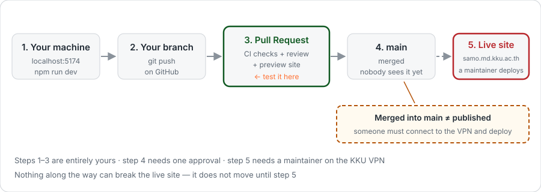
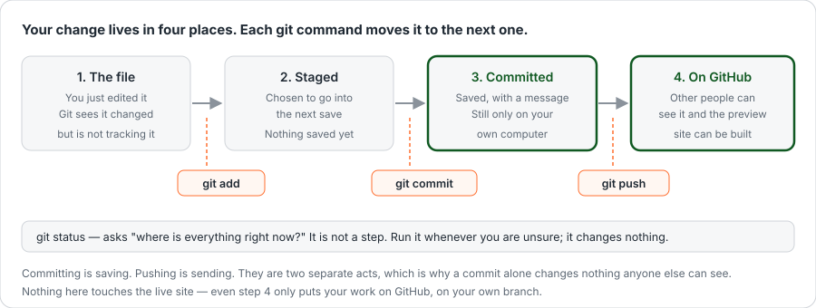
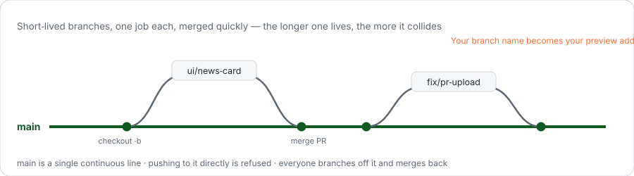
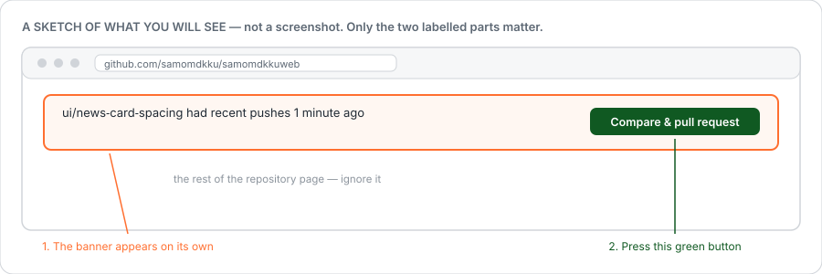
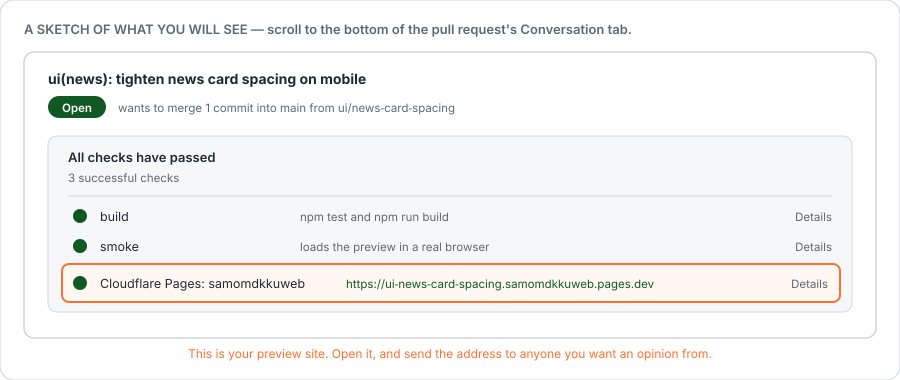

# Your first change

From editing a file on your machine to having it merged.



Every command on this page is typed into the **terminal**, from inside the `samomdkkuweb` folder. If you have not set that up yet, do [Install and run](/start/install) first.

## The five words you need before you start

You can follow the steps without these, but you will be copying spells. Five minutes here saves an afternoon.

**Repository (repo)** — the project folder, plus its entire history. When you cloned it you got both.

**Commit** — one saved point in that history, with a short message saying what changed and why. Think of it as a labelled save, not a file backup. History is a chain of commits.

**Branch** — a named line of commits. `main` is the line the project ships from. When you start a piece of work you make your own line, do your commits there, and it stays out of everyone's way until it is ready. Branches are cheap; make one per piece of work and delete it afterwards.

**Push / pull** — your machine has a copy of the history and GitHub has a copy. `push` sends your commits up. `pull` brings other people's down. Neither happens on its own.

**Pull request (PR)** — the request to fold your branch into `main`. It is a page on GitHub showing exactly what you changed, where people comment, where the automated checks report, and where the preview site link appears. It is the conversation about the change, not the change itself. "Pull request" is GitHub's word for *please pull my branch in*.



## 1. Start from the current code

```bash
git checkout main
git pull origin main
```

`git checkout main` switches you to the `main` line. `git pull origin main` downloads whatever other people have merged since you last looked. (`origin` is git's name for "the copy on GitHub".)

Takes a few seconds, and skipping it is the usual reason a change later collides with somebody else's.

## 2. Make a branch

```bash
git checkout -b ui/news-card-spacing
```

**You should see** `Switched to a new branch 'ui/news-card-spacing'`.

`checkout -b` means *make a new branch and switch to it*. From now on, commits go onto that branch and `main` is untouched.

::: warning A branch is required, not just polite
`main` is protected. Pushing to it directly is refused by GitHub — a rule the system enforces, not a convention you could bend in a hurry.
:::



Name it `<type>/<short-topic>`, lowercase, hyphens between words.

| Prefix | Use it for | Example |
|---|---|---|
| `feat/` | Something new | `feat/golden-period-page` |
| `fix/` | A bug | `fix/vs-form-double-submit` |
| `ui/` | Colours, spacing, layout | `ui/news-card-spacing` |
| `docs/` | Documentation only | `docs/install-guide` |

**The branch name becomes your preview address**, so keep it short: `ui/news-card-spacing` becomes `https://ui-news-card-spacing.samomdkkuweb.pages.dev`.

**One branch per change.** Two unrelated changes means two branches. Small pull requests get reviewed within the day; large ones sit.

::: tip "Which branch am I on?"
```bash
git branch --show-current
```
Worth running whenever you are unsure. It is the answer to more confusion than any other git command.
:::

## 3. Make the change and watch it

In a second terminal window:

```bash
npm run dev
```

Edit files in your editor; the page updates itself. Before going further, confirm both of these finish without errors:

```bash
npm test
npm run build
```

These are the same two checks CI will run on your pull request, so running them now turns a twenty-minute round trip into a twenty-second one.

## 4. Save your work — `add`, then `commit`

Two separate acts, and the split is the part that confuses everyone:

```bash
git status                       # what changed? run this first, every time
git add src/css/news.css         # choose which files go into the save
git commit -m "ui(news): tighten news card spacing on mobile"
```

`git add` **chooses**. `git commit` **saves what you chose**, with a message. Nothing has left your computer yet.

The message is read later by someone trying to understand why a line looks the way it does. Say what changed and why, in one line: `ui(news): tighten news card spacing on mobile` — not `update` or `fix stuff`.

::: danger Why `git status` before `git add .`
`git add .` stages *everything that changed*, including things you did not mean to include — a screenshot you saved into the folder, a scratch file, a `.env.local` you renamed while debugging.

This repository is public, and **git history cannot be reliably erased.** Deleting a file tomorrow does not remove it from today's commit. Once a name, a รหัสนักศึกษา, an email address or a photograph is committed, it is in the history permanently, and the only real remedy is rewriting history for everyone.

Naming your files costs three seconds.
:::

Now send the branch to GitHub:

```bash
git push -u origin ui/news-card-spacing
```

**You should see** a few progress lines and then a block offering a URL to *create a pull request*. That URL is the next step; you can open it directly if you like.

`-u origin <branch>` is only needed the **first** time you push a new branch — it tells git where this branch belongs. Afterwards, plain `git push` is enough.

::: warning If it says `Permission denied` or `403`
You are pushing to the project itself without being a collaborator. Nothing is lost — your commits are safe on your machine. Take your own copy as described in [Install and run](/start/install), step 2, and push there instead.
:::

## 5. Open the pull request

```bash
gh pr create --fill --web
```

Or do it in the browser: go to the repository on GitHub and a **Compare & pull request** banner is sitting at the top, because you pushed a branch a moment ago.



::: tip What the repository actually looks like
The real thing, so the sketch above is easier to place. **Fork** is top right;
**Pull requests** is in the row of tabs. This is the logged-out view — signed in
you also get your own avatar in the top bar, but the buttons are in the same
places.


:::

Write three things. None needs to be long.

1. **What changed** — one sentence
2. **Why** — what it was like before
3. **How you tested it** — which screen widths you checked; 390 / 820 / 1280 px is the usual set

::: tip Open it before you are finished
Use **Create draft pull request**. Other people can see what you are working on so nobody duplicates it, and you get the automated checks and a preview site while you are still going. Put `[help]` in the title if you are stuck — that is what it is for.
:::

## 6. Open your preview site

Every branch except `main` gets a live site, built automatically. Scroll to the bottom of the pull request's **Conversation** tab: the checks box lists the preview alongside the other checks, usually within a couple of minutes of pushing.



<!-- REAL-SCREENSHOTS-SLOT: replaced on this branch with captures of the actual
     banner and checks box, taken while signed in. -->

Or ask for the address directly, from the branch:

```bash
npm run preview:url
```

::: danger Two addresses are listed. The first one is not the one you want.
Cloudflare's check shows a **Preview URL** and a **Branch Preview URL**. The first is one single build — your next push makes a new one and that address serves the old code for ever. The second follows the branch.

**If it starts with eight random characters, it is a single build.** Bookmark the one with your branch name in it, and send that one to people. `npm run preview:url` always prints the right one.
:::

**The preview is connected to `samo-dev`, the copy of the database — not the real one.** Click, submit forms, create test records. The branch address stays the same for the life of the branch and rebuilds on every push, so you can bookmark it once and send it to someone in your ฝ่าย for a second opinion; they need to install nothing.

Test **here**, not only on your own machine. It is a real site on a real phone, which `localhost` can never be. [Where the site runs](/start/where-it-runs) explains all four addresses and which database each one touches.

## 7. Wait for the checks and the review

| Check | Takes | If it is red |
|---|---|---|
| **build** — runs `npm test` and `npm run build` | ~2 min | Click *Details* and read the **first** red line; the rest is usually noise from it |
| **Cloudflare Pages: samomdkkuweb** — builds your preview | ~2 min | Usually means `build` failed too — fix that first |
| **smoke** — loads the finished preview in a real browser | ~1 min | The page builds but does not run. This one only starts once the preview has built |

To fix something, **do not open a second pull request.** Commit and push to the same branch:

```bash
git add <files>
git commit -m "ui(news): use the token instead of a literal"
git push
```

The pull request updates itself and every check re-runs. That is the normal rhythm — a pull request with several commits on it is expected, not untidy.

Who has to approve depends on which files you touched — see [What you can change](/contributing).

## 8. Merged is not published

Merging into `main` does **not** put your change on the live site. A maintainer connects to the KKU VPN and deploys, usually batching several merged pull requests together.

This is deliberate. Approving a pull request is low-risk and easy to undo, which keeps review fast and friendly. The careful, slow check happens once, at deploy time, by someone who can watch the live site afterwards.

So: your change being merged means it is accepted and queued. Ask a maintainer if you need it live by a particular day.

## 9. Tidy up

Once it is merged:

```bash
git checkout main
git pull origin main
git branch -d ui/news-card-spacing
```

Back on `main`, up to date, old branch gone. This is also step 1 of your next change.

## Every command in one place

```bash
# starting a piece of work
git checkout main && git pull origin main
git checkout -b ui/my-topic
npm run dev

# saving as you go
git status
git add <files>
git commit -m "ui(scope): short description"

# sending it
npm test && npm run build
git push -u origin ui/my-topic
gh pr create --fill --web
npm run preview:url

# after it is merged
git checkout main && git pull origin main
git branch -d ui/my-topic
```

## When something goes wrong

| It says | It means | Do |
|---|---|---|
| `not a git repository` | You are not in the project folder | `cd` into `samomdkkuweb` |
| `Updates were rejected` | GitHub has commits you do not | `git pull origin <your-branch>`, then push again |
| `protected branch` on push | You are on `main` | `git checkout -b <name>` and push that |
| `Your local changes would be overwritten` | Uncommitted edits are in the way | Commit them, or `git stash` to set them aside |
| Nothing to commit, but you did edit | You forgot `git add` | `git status` shows what is unstaged |

More in [Troubleshooting](/start/troubleshooting).

Next — [When your work depends on other work](/start/dependent-work)
